
<h1 align="center">车险理赔信息管理系统</h1>

## 简介
车险理赔信息管理系统：角色分为用户和管理员；主要功能包括理赔申请、事故调查、用户信息管理、保险订单管理、公告管理、数据统计和分析，通过模块化设计提高理赔效率和透明度，界面简洁直观。    --计算机毕业设计源码；毕设源码；java毕业设计源码

## 联系方式

<h3 align="center">获取完整代码与数据库文件 + 微信：deepguan QQ: 86050149 QQ群: 783742310</h3>

<h3 align="center">可帮忙远程部署 包运行成功！提供远程部署、修改代码、设计文档指导、代码讲解等服务！</h3>

## 功能介绍（完整见运行截图）
管理员：管理员可以进行用户管理、保险管理、论坛管理、公告管理、事故调查管理、理赔申请管理、现场勘查管理，以及基础数据管理。界面提供了查看、修改、删除和新增的操作功能，支持通过各类筛选条件进行数据查询。管理员可以编辑和发布公告，管理用户的个人信息，处理或审核理赔申请，并维护事故调查记录。管理员通过个人中心可以查看详细信息，修改或删除内容，并对理赔进行了数据管理和分析。

用户：用户可以通过界面登录系统并访问主导航栏，包括保险信息、论坛、公告及个人中心等模块。在个人中心，用户能够查看和编辑个人信息，还可以管理自己的保险订单、事故调查记录、理赔申请和现场勘查信息。用户可以提交新的理赔申请，上传相关文件和照片，并查看理赔申请的进度和状态。在事故调查模块，用户可以输入调查详情和上传照片，以便于事故报告和后续操作。用户个人页面也允许查看自己的事故调查类型和订单详情。

## 运行截图
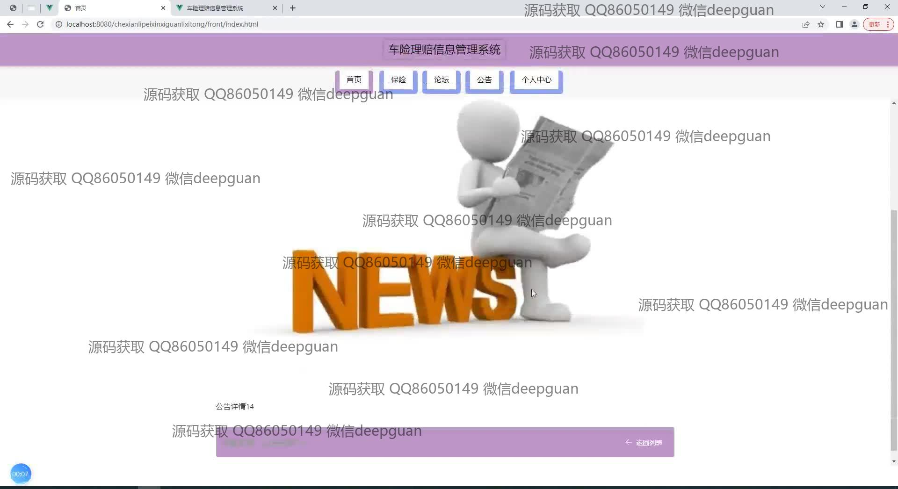
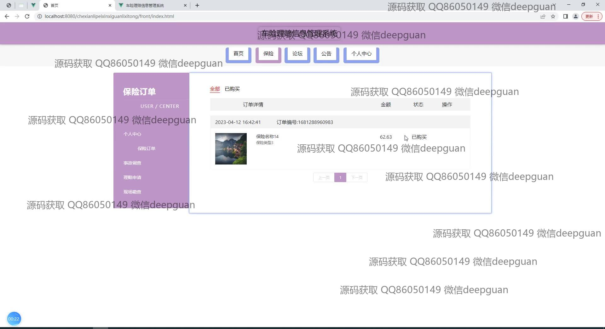
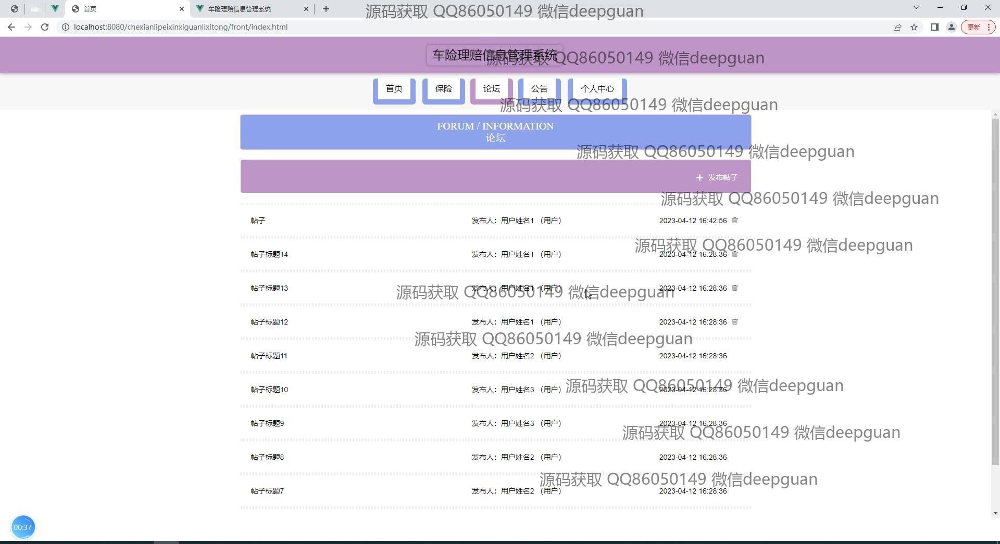
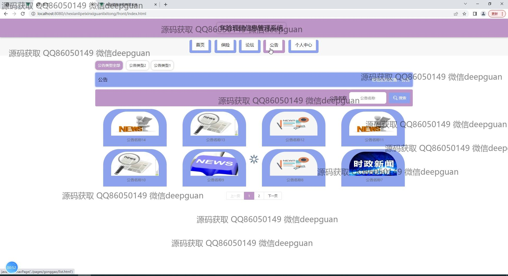
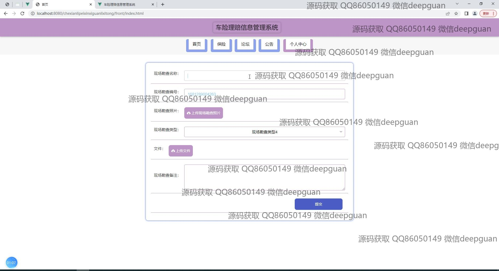
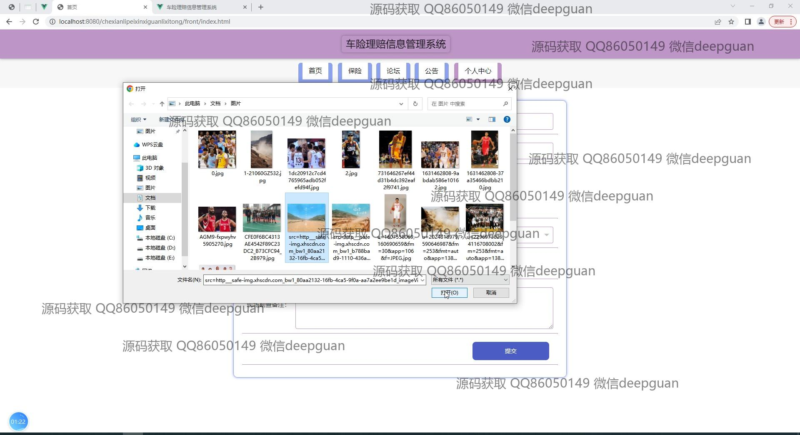
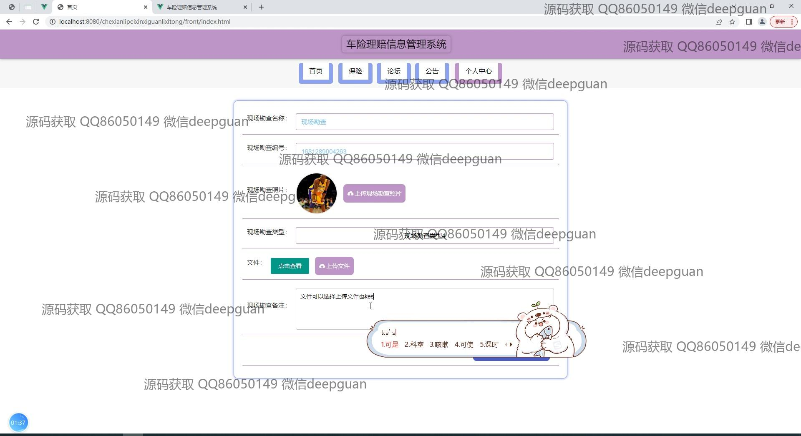
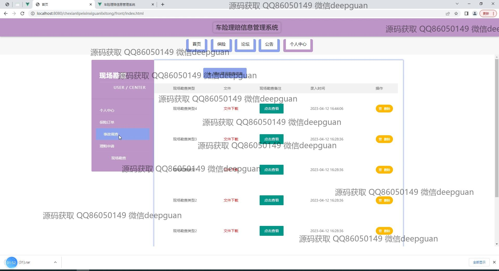

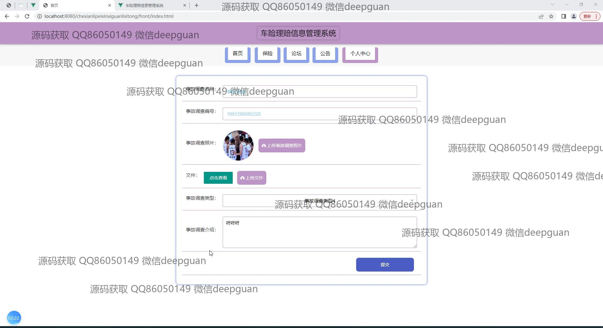
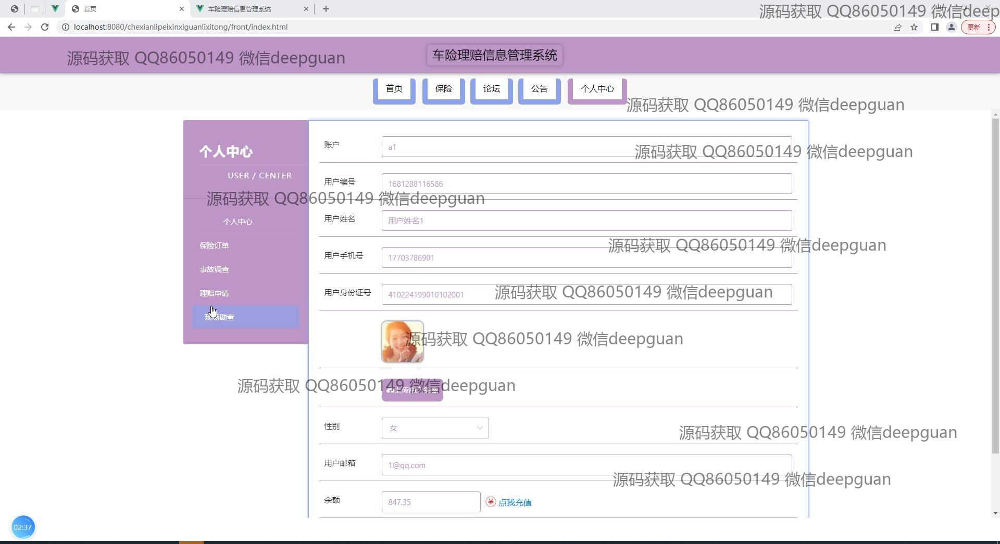
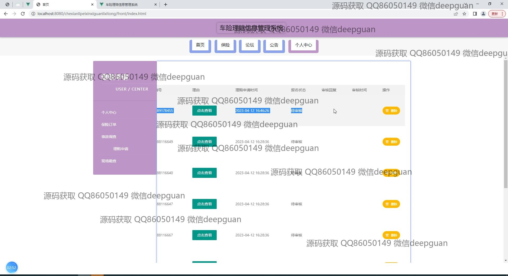
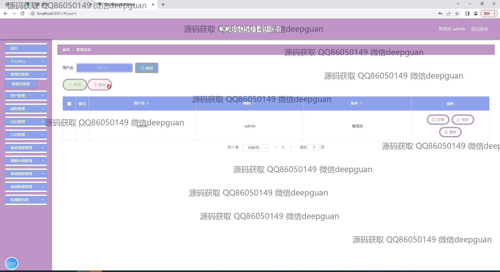
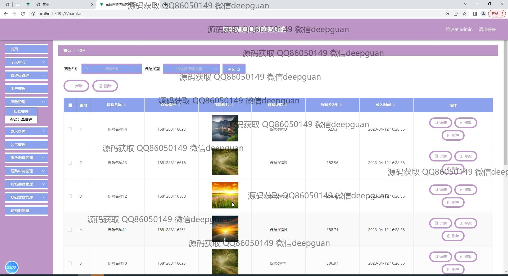
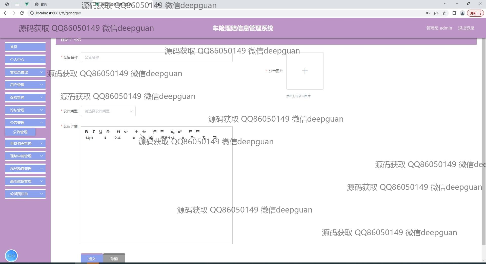
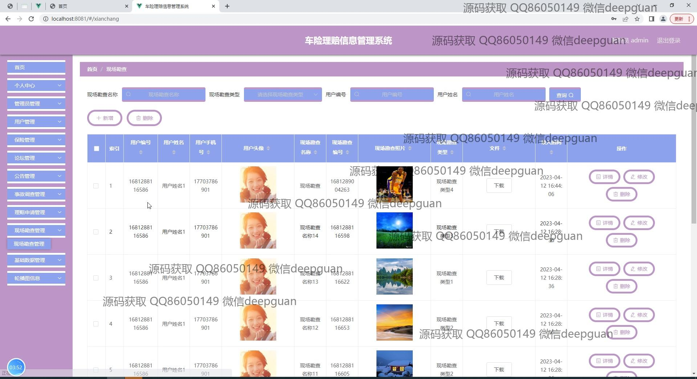
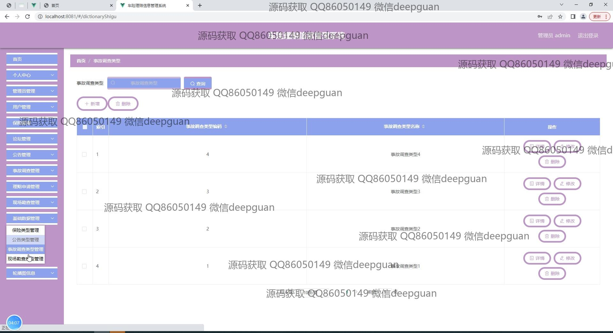
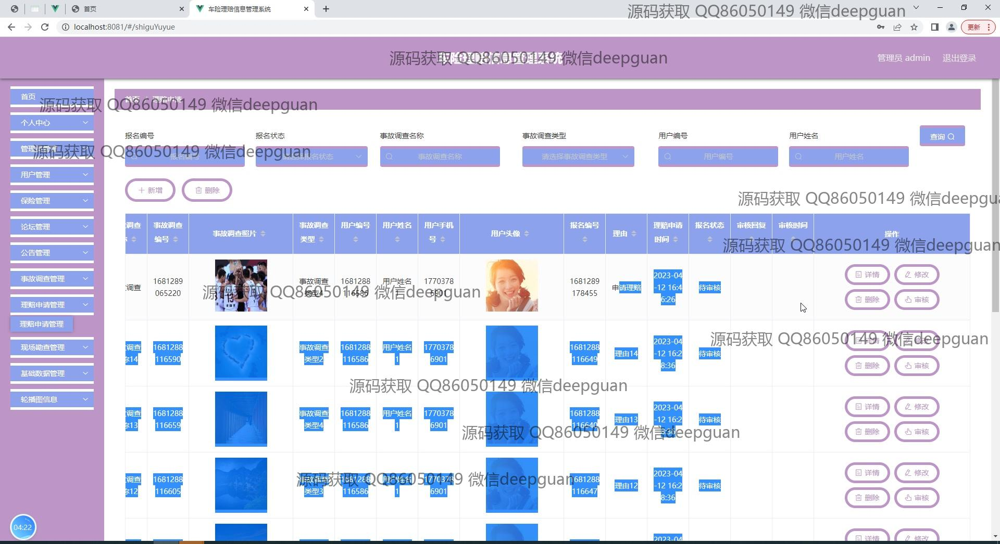
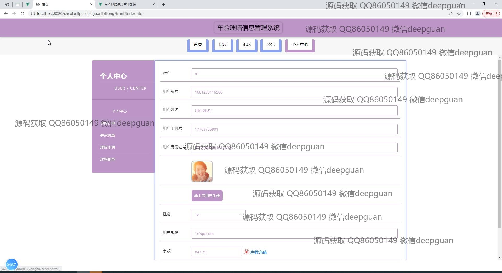
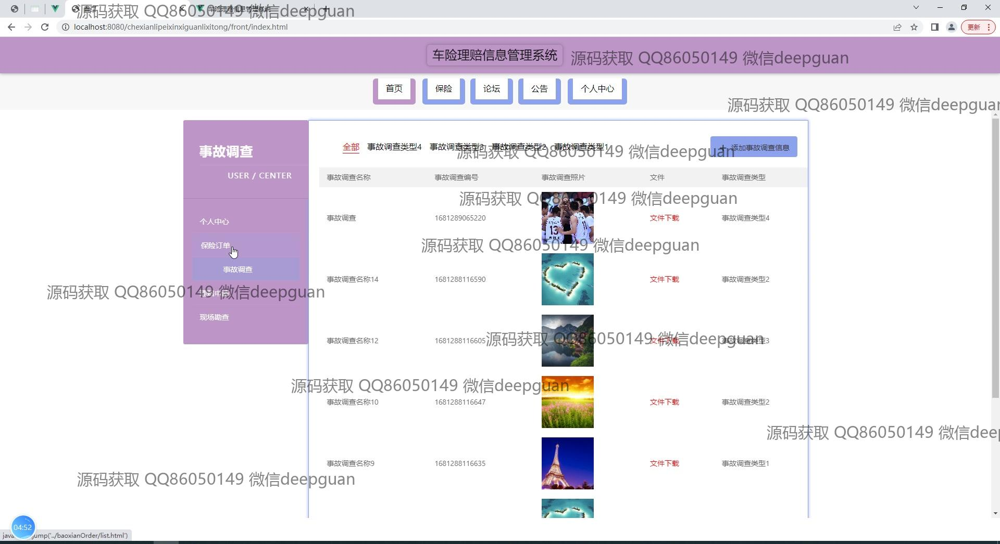

本代码来源于网络,仅供学习参考使用!

